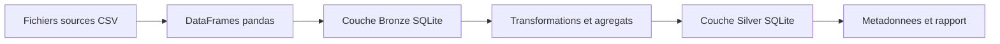

# Schéma simplifié du pipeline ETL

## Vue d’ensemble

Pipeline medallion simplifié :

- **Bronze** : données brutes issues des CSV.
- **Silver** : données transformées et agrégées (coûts, rentabilité, bénéfices, pannes, etc.).

---

## Diagramme du pipeline (Mermaid)

---

## Légende

- **Fichiers sources CSV** : tous les fichiers `bloc5_*.csv` et `machines/*.csv`.
- **DataFrames pandas** : lecture, typage (IDs en `str`, dates en `datetime`).
- **Couche Bronze SQLite** : tables `bronze_*` dans `database_encrypted.sqlite` (SQLCipher).
- **Transformations et agregats** : feature engineering, jointures, agrégations (coûts, rentabilité, bénéfices, pannes).
- **Couche Silver SQLite** : tables `silver_*` avec `_silver_load_timestamp_utc`.
- **Metadonnees et rapport** : horodatage d’ingestion et `rapport_import` (table, rows, columns, status).

---

## Notes d’implémentation

- Base chiffrée via `pysqlcipher3` et clé `SECRET_KEY` depuis `.env`.
- Bronze : `if_exists="append"`.
- Silver : `if_exists="replace"`.
- Gestion transactionnelle : `commit` / `rollback` + fermeture de la connexion.
